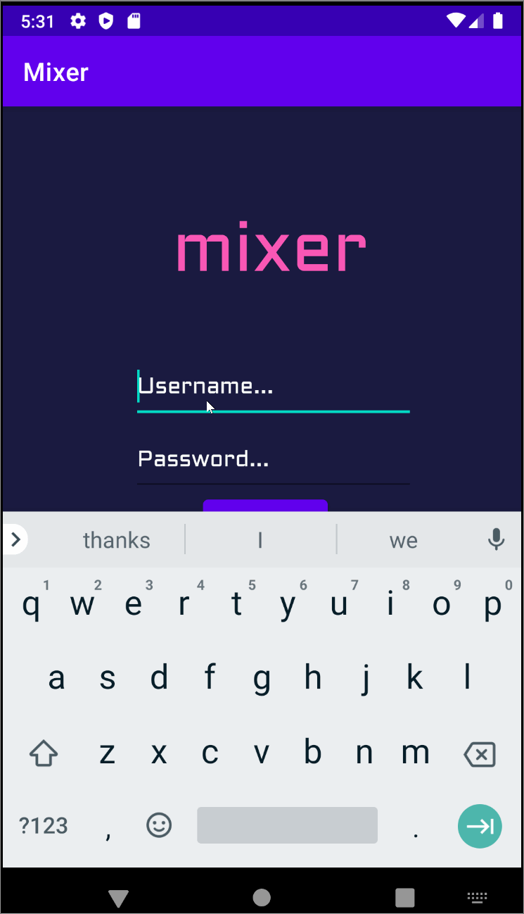

# Mixer app
This is the repo for the student led app dev course, offered via CodePath.
Original App Design Project - README Template
===

# MIXER

## Table of Contents
1. [Overview](#Overview)
1. [Product Spec](#Product-Spec)
1. [Wireframes](#Wireframes)
2. [Schema](#Schema)

## Overview
### Description
**Mixer** is an android app that allows users to view the latest cocktails and recipes to the drinks. Users can create a favorites drink list. API to use: https://www.thecocktaildb.com/api.php
Contributer: **John Sena Akoto**, **Karl Devlin**

### App Evaluation
- **Category:** Food and Drink
- **Mobile:** Mobile is essential for quick access to recipes for cocktails. Also, at the club/bar you can look up popular drinks and order them.
- **Story:** Helps people find popular drinks to order at the bar or make themselves at home.
- **Market:** College students, and any young adults over the age of 21.
- **Habit:** Young adults are making their own cocktails at their kickbacks, game nights and date nights at home
- **Scope:** V1 would allow users to access popular cocktails and recipes. V2 would incorporate users making and submitting custom cocktail recipes

## Product Spec

### 1. User Stories (Required and Optional)

**Required Must-have Stories**

- [X] User can log in and out using Parse authentication
- [X] User can sign up using Parse Authentication
- [X] User can see a recyclerlist of popular cocktails (drink name, picture, overview) in main activity
- [X] User can expose details of a cocktail in a separate activity (detail activity)
- [X] User can navigate between tabs (stream and favorites)
- [X] Favorites are sent and strored to the user's account

**Optional Nice-to-have Stories**

- [X] User can delete drinks in favorite list
- [X] After User deletes a favorite in favorites fragment a snackbar is made, prompting the user to undo the removal.
- [X] A search fragment where user can search based on ingredient.
- [X] A progress bar that indicates the search is ongoing. 
- [X] User can favorite drinks in mainactivity and detail activity
- [X] User can expose favorite drinks recyclerlist in a separate activity (favorite activity)

### 2. Screen Archetypes

* Login/Register Screen
   * User can log in and out using Parse authentication
   * User can sign up using Parse Authentication

* Stream Screen
   * User can see a recyclerlist of popular cocktails (drink name, picture, overview) in stream activity
   * User can favorite drinks in stream activity
   * User can expose details of a cocktail in a separate activity (detail activity)
   * User can expose favorite drinks recyclerlist in a separate activity (favorite activity)

* Detail Screen
   * User can favorite drink in detail activity
   * User can see details of recipe
   * User can expose favorite drinks recyclerlist in a separate activity (favorite activity)
   * User can navigate to stream activity

* Favorites Screen
   * User can see a recyclerlist of favorited cocktails (drink name, picture, overview) in favorite activity
   * User can navigate to stream activity

### 3. Navigation

**Tab Navigation** (Tab to Screen)

* Stream
* Favorites

**Flow Navigation** (Screen to Screen)

* Login/Register
   * Stream
* Stream
   * Detail
   * Favorites
* Detail
   * Stream
   * Favorites
* Favorites
   * Detail
   * Stream

## Wireframes


## Schema 
[This section will be completed in Unit 9]
### Models
| Property	| Type	| Description |
| --- | --- | --- |
| Image	| File	| Image of cocktail |
| Ingredients	| Array	| List of ingredients pertaining to cocktail |
| Name	| String	| Name of cocktail |
| Description	| String	| Description of cocktail |
| Type	| String	| Type of cocktail |
| IsAlcoholic	| Boolean |	True if the cocktail has alcohol |
| Username | Pointer to user | The username of the user |
| Password |	Pointer to user |	The password of the user |
| Favorite |	Boolean	| True if cocktail is a favorite |
### Networking
- Stream Screen
  - (Read/Get) Get all 10 random cocktails from API
  - Create/POST) Create a new like on a cocktail
  - (Delete) Delete existing like
- Favorites Screen
  - (Read/Get) Query all cocktails from the API that are listed as the user's favorites/liked

```
let query = PFQuery(className:"Drink")
query.whereKey("author", equalTo: currentUser)
query.whereKey("DrinkI", equalTo: Favorite)
query.order(byDescending: "createdAt")
query.findObjectsInBackground { (posts: [PFObject]?, error: Error?) in
   if let error = error { 
      print(error.localizedDescription)
   } else if let Drinks = Drinks {
      print("Successfully retrieved \(Drinks.count) drinks.")
  // TODO: Do something with drinks...
   }
}
```

- Login Screen
  - (Read) Check if an account already exsists for the user.
- Detail Screen
  - (Read/Get) Get the details pertaining to the cocktail from API

## Video Walkthrough

Here's a walkthrough of implemented user stories:



GIF created with [LiceCap](http://www.cockos.com/licecap/).

Favorite Button Copyright:

Copyright 2016 Joel Dean

Licensed under the Apache License, Version 2.0 (the "License");
you may not use this file except in compliance with the License.
You may obtain a copy of the License at

http://www.apache.org/licenses/LICENSE-2.0

Unless required by applicable law or agreed to in writing, software
distributed under the License is distributed on an "AS IS" BASIS,
WITHOUT WARRANTIES OR CONDITIONS OF ANY KIND, either express or implied.
See the License for the specific language governing permissions and
limitations under the License.
